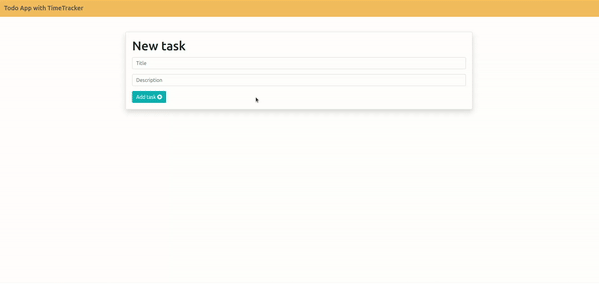

<div id="top"></div>

<h3 align="center">ToDo App with a time tracker </h3>

  <p align="center">
    <br />
    <a href="#demo">View Demo</a>
  </p>
</div>


<!-- TABLE OF CONTENTS -->
<details>
  <summary>Table of Contents</summary>
  <ol>
    <li>
      <a href="#about-the-project">About The Project</a>
      <ul>
        <li><a href="#built-with">Built With</a></li>
      </ul>
    </li>
    <li>
      <a href="#getting-started">Getting Started</a>
      <ul>
        <li><a href="#prerequisites">Prerequisites</a></li>
        <li><a href="#installation">Installation</a></li>
      </ul>
    </li>
    <li><a href="#license">License</a></li>
    <li><a href="#contact">Contact</a></li>
  </ol>
</details>


<!-- ABOUT THE PROJECT -->
## About The Project

Easy to manage todo list with a time tracker 

### Built With

* [React.js](https://reactjs.org/)


## Demo



<!-- GETTING STARTED -->
## Getting Started

To get a local copy up and running follow these steps

### Prerequisites

* install the latest node package manager
  ```sh
  npm install npm@latest -g
  ```
### Installation

1. Get a free API Key at [https://todo-api.coderslab.pl/apikey/create](https://todo-api.coderslab.pl/apikey/create)
2. Clone the repo
   ```sh
   git clone https://github.com/ikolokotronis/timetracker-todo-app.git
   ```
3. Install NPM packages (in the project's directory)
   ```sh
   npm install
   ```
4. Enter your API in `api/config.js`
   ```js
   const API_KEY = 'ENTER YOUR API';
   ```

<p align="right">(<a href="#top">back to top</a>)</p>


<!-- LICENSE -->
## License

Distributed under the MIT License. See `LICENSE.txt` for more information.

<p align="right">(<a href="#top">back to top</a>)</p>


<!-- CONTACT -->

## Contact
Ioannis Kolokotronis - ioanniskolokotronis1@gmail.com

Project Link: [https://github.com/ikolokotronis/timetracker-todo-app](https://github.com/ikolokotronis/timetracker-todo-app)

<p align="right">(<a href="#top">back to top</a>)</p>
